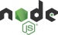
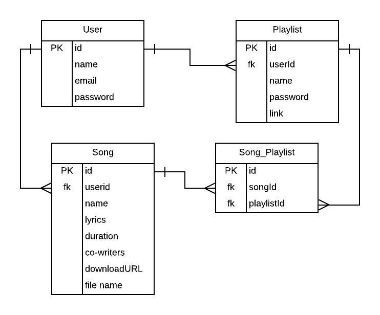

<h1 style="font-weight: bold">Song-Share</h1>

<h2 style="font-weight: bold">The Information Dashboard</h2>

<h3>Song-Share is a new product offering that you have been tasked with building. It's a dashboard for people to use to organize their daily tasks, events, news article, friends, and chat messages.</h3>

<h2 style="font-weight: bold;"> Technologies Used
<h3>Development Languages and Libraries</h3>

______________________________

<h1></h1>
<h3>Development Tools</h3>

__________________


<h2>Instructions for Installing Mission Control</h2>

<h4> You will need to have command line tools installed for your computer to use terminal commands.
</h4>

  * Mac users - Open your terminal and type

    ```sh
    git --version
    ```

  * Linux/Windows users, please vist the [Git page](https://git-scm.com/book/en/v2/Getting-Started-Installing-Git) and follow the instructions for setup

<h4>You will now need to configure your git account. In the terminal window, type</h4>

  ```sh
  git config –global user.name “You Name”
  git config –global user.email “Your Email”
  ```

#### Create a new directory to store the files in. Type this into your terminal window.

  ```sh
  mkdir songShare
  cd songShare
  git clone git@github.com:jasehackman/Capstone-Song-Share.git
  ```

#### If you do not have Node.js installed on your machine, visit the [Node.js Download Page](https://nodejs.org/en/download/) and follow the included instructions. To ensure that it is installed correctly, in your terminal window, type

```sh
echo $PATH
```
  * Ensure that the result has the following in the $PATH

    ```sh
    /usr/local/bin
    ```
    or
    ```sh
    /usr/local/bin:/usr/bin:/bin:/usr/sbin:/sbin
    ```

#### You will need to go into the lib folder in your  directory and install and build npm modules and also your json-server. In your terminal, type

```sh
cd songShare/src/lib
npm init
npm i
sudo npm install -g json-server
```

#### From your terminal window, type

```sh
cd songShare/api
json-server -p 8088 database.json
```

#### From your terminal window, type Command T, then in the new tab type

```sh
cd songShare
npm start
```
#### Now that the server is up and running, you can open an internet browser and access the application:
```sh
http://localhost:8080/
```

#### The database can be accessed by entering the following in the url bar.

```sh
http://localhost:8088/
```

<h1 style="text-align:center; font-weight: bold;">Congratulations! You are now experiencing Song-Share!

<h2 style="text-align: center">Entity Relationship Diagrams</h2>



